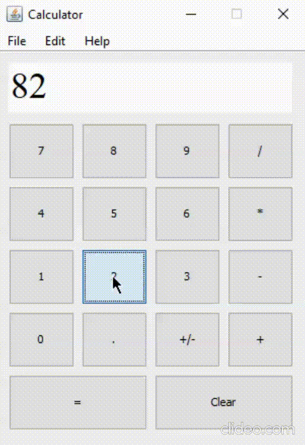

# Calculator
A basic calculator app implemented in Java using Swing API.

Swing API is a set of extensible GUI Components to ease the developer's life to create JAVA based Front End/GUI Applications. It is built on top of AWT API and acts as a replacement of AWT API since it has almost every control corresponding to AWT controls.

 

# Execution is as follows:-

 

Open to suggestions :)
